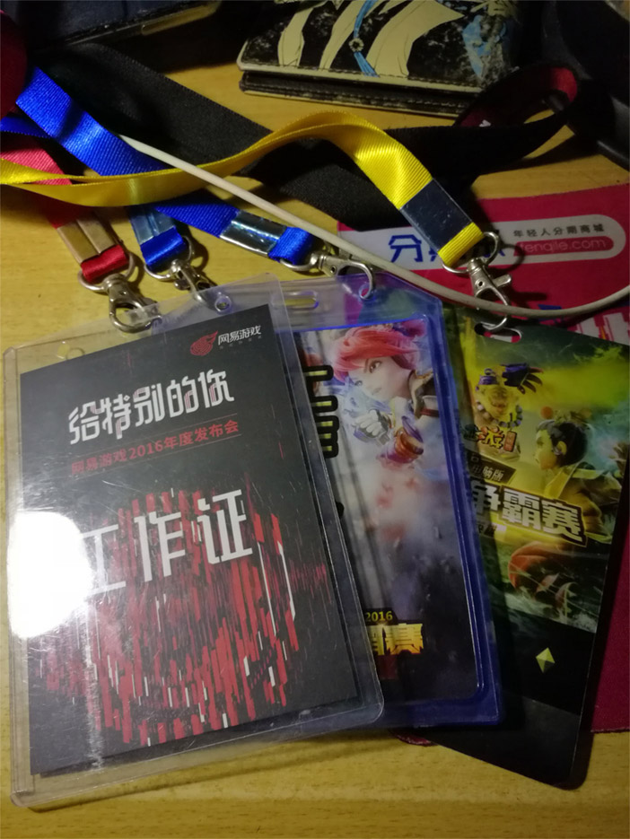
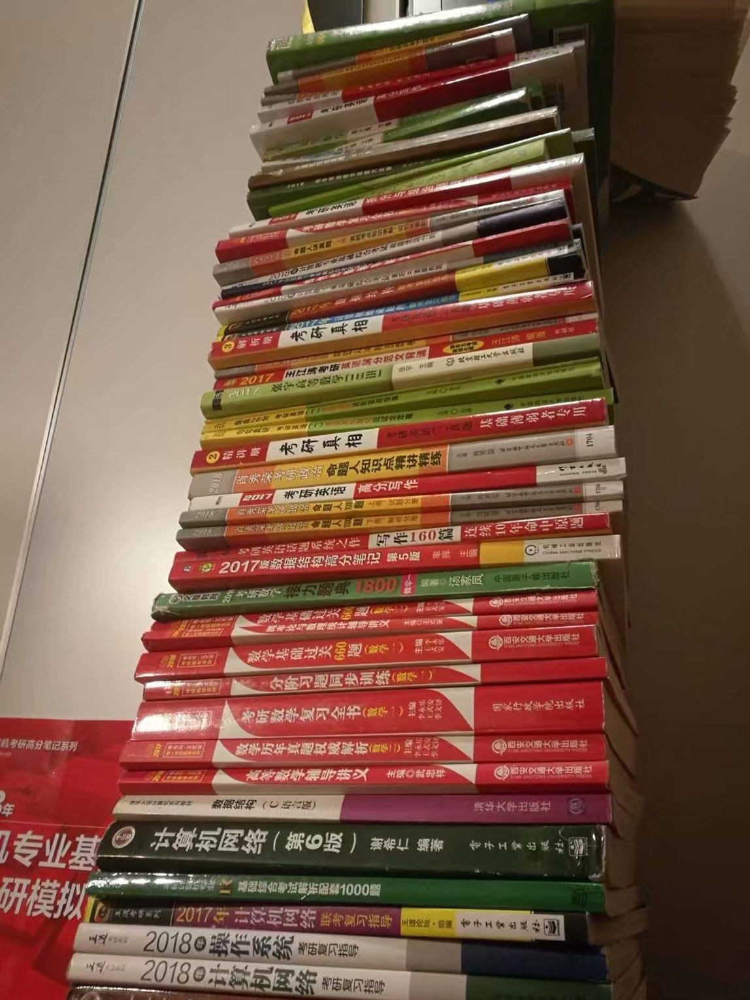

# about

# 前言
开坑一时爽，填坑火葬场，又做大死开了个新坑。本人虽然接触前端时间比较短，但是还是有点心得可以分享一下给大家。按照国际惯例先介绍一下自己。
# 过去经历
本人本科读的是电子信息工程，17年毕业。但是很遗憾我在大学除了焊电路板和写嵌入式，居然没有接触过前端，让大家失望了。程序也没写多，反而天天沉迷于做视频。一开始学习是为了做MAD（卡通视频）和生活费不够需要剪片赚点吃饭钱，后来越做越上瘾，天天晚上9点下课（没错大学基本满课，早上8点上到晚上9点，周末还要做实验）打开AE（adobe的视频软件）沉迷其中不能自拔。一做就3年，最后还因为做视频技术挺好，去了网易游戏直播栏目与包装。虽然后面由于某种原因被调去做项目跟进负责人。负责活动的分镜脚本、舞台搭建、美术资源管理、直播场控等等一条龙服务。

# 想进前端的初心
经过半年的项目负责人，虽然每天工作非常饱和，内心却无比空虚。也慢慢发现自己的本性是比较专研点东西，喜欢往深度方向走。就像作家需要用写作、程序员需要编程、画家需要画画把精神寄托在作品上边。然后又认识几个前端的同事。当时他给我看了几个网站，深深被吸引了  
[濒临灭绝动物](http://www.species-in-pieces.com/)   
[我的世界预约](http://egdc.163.com/2096.html)  
我的世界这个是用webgl做的可交互页面，还有天气系统。虽然现在已经没法访问，但是可以点击链接看看设计图。从此就有一颗考研去做计算机图形处理的苗头。

# 考研与找工作
经过半年思想的挣扎，和评估风险与收益，决定放弃当前待遇很不错的工作去考研。经过半年的努力，学习数据结构与算法，计算机组成原理，网络工程，操作系统等，然后不负众望没有考上。。。。。。

考研失败之后只能临急临忙去学点前端的东西，大概一月都不够。找工作的时候只能社招，四处碰壁。那时候连3k的工作都不要我，那种感觉到现在还深深刻在我脑里，也成为我这一年玩命学习的动力。最后可能上天没放弃我，有一家公司还是收了我。

这半年看的书籍。