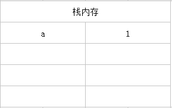
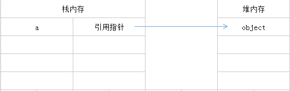
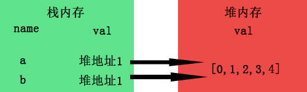
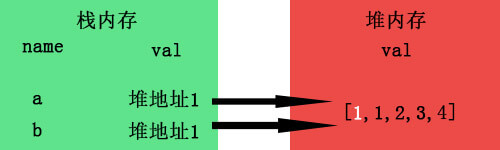
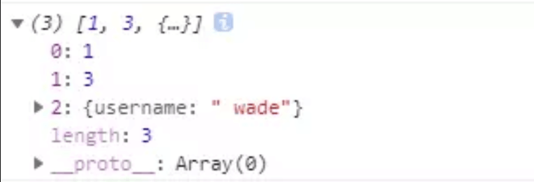
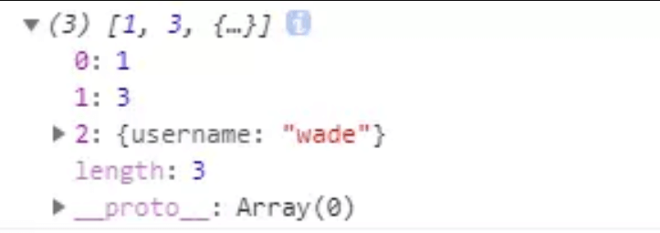
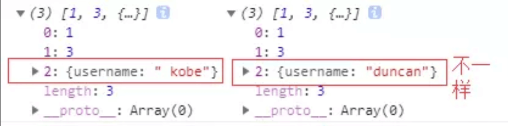

# 关于类型
## 类型种类
JS 中分为七种内置类型，七种内置类型又分为两大类型：基本类型和引用类型  
### 基本类型
- [字符串（string）](./1.typeDetail.md#类型string)
- [数值（number)](./1.typeDetail.md#类型number)
- [布尔值（boolean）](./1.typeDetail.md#类型boolean)
- [null](./1.typeDetail.md#类型null)
- [undefined](./1.typeDetail.md#类型undefined)
- [symbol](./1.typeDetail.md#类型symbol)

#### 特点
- 基础类型将内容直接存储在栈中（大小固定位置连续的存储空间）
- 记录的是该数据类型的值，即直接访问
- 保存与复制的是值本身
- 方法中定义的变量都是放在栈内存中
- 使用typeof检测数据的类型 ref 类型判断

```javascript
a = 2;
```


### 引用类型
- [对象（Object）](./1.typeDetail.md#对象object)
- [数组（Array）](./1.typeDetail.md#对象array)
- 函数（Function）
- [字符串（String）](./1.typeDetail.md#对象string)
- [日期（date）](./1.typeDetail.md#对象date)
- [正则（Reg）](./1.typeDetail.md#对象regExp)
- [Set](./1.typeDetail.md#对象set)
- Map
#### 特点
占用空间不固定，保存在堆中这个运行时数据区就是堆内存。堆内存中的对象不会随方法的结束而销毁，即使方法结束后，这个对象还可能被另一个引用变量所引用。

```javascript
var a = new Object();
```


- 保存与复制的是指向对象的一个指针
- 使用instanceof检测数据类型 ref 类型判断
- 使用new()方法构造出的对象是引用型 ref new

## 本地对象、内置对象和宿主对象

### 本地对象
ECMA-262把本地对象（native object）定义为：独立于宿主环境的ECMAScript实现的对象。

这里简单说一下JavaScript的应用环境，JavaScript的应用环境由宿主环境和运行期环境构成。宿主环境主要是指外壳程序（shell）和Web浏览器等，运行期环境由JavaScript引擎内建的。


现在来看一下本地对象有哪些： 

- Object
- Function
- Array
- String
- Number
- Date
- RegExp
- Boolean
- Error
- EvalError
- RangeError
- ReferenceError
- SyntaxError
- TypeError
- URIError 

由此得出，JS的本地对象就是ECMA-262中定义的类（引用类型）。

### 内置对象
 ECMA-262把内置对象定义为：由ECMAScript提供实现的、独立于宿主环境的所有对象，在ECMAScript程序开始执行时出现。
 
 这意味着内置对象都是已经实例化好的，不需要我们再进行实例化了，这里我们首先会想到的就是Math对象。 
 
 ECMA-262定义的内置对象只有两个：Global和Math。（本地对象和内置对象都是独立于宿主对象，根据定义可以看出来内置对象也是本地对象，在JS中所有的内置对象都是本地对象）。
 
 Math对象是我们经常用到的，但是Global就比较少见了。其实我们经常用到Global对象，只是没有用Global这个名字。
 
  Global对象是一个比较特殊的对象，它是一个全局对象，在程序中只有一个，它的存在伴随着整个程序的生命周期，全局对象不能通过名字来访问，但是它有一个window属性，这个属性指向它本身。
  
  大家也要清楚，在ECMAScript中不存在独立的函数，所有的函数都应该是某个对象的方法。类似于isNaN()、parseInt()、parseFloat()等方法都是Global对象的方法。
  
  
### 宿主对象
宿主对象：由ECMAScript实现的宿主环境提供的对象。
   
可能这样不是很好理解，上面已经说过了宿主环境包括Web浏览器，所以我们可以这样理解，浏览器提供的对象都是宿主对象。
  
也可以这样理解，因为本地对象是非宿主环境的对象，那么非本地对象就是宿主对象，即所有的BOM对象和DOM对象都是宿主对象。 
   
那么还有一种对象，那就是我们自己定义的对象，也是宿主对象。

最简单的理解：ECMAScript官方未定义的对象都属于宿主对象。

### 总结

官方的定义太绕口，还不好理解。说的简单点：

本地对象就是ECMAScript中定义好的对象，如String、Date等，内置对象是本地对象中比较特殊的一种，它不用实例化，包括Global和Math，宿主对象就是BOM、DOM和自己定义的对象。


## 类型转换
### 定义
编程语言按照数据类型大体可以分为两类，一类是静态类型语言，另一类是动态类型语言。
#### 静态类型
编译时便已确定变量的类型

**优点**
- 编译时就能发现类型不匹配的错误
- 编译器还可以针对这些信息对程序进行一些优化工作，提高程序执行速度

**缺点**
- 让程序员的精力从思考业务逻辑上分散开来

### 动态类型
动态类型语言的变量类型要到程序运行的时候，待变量被赋予某个值之后，才会具有某种类型

**优点**
- 编写的代码数量更少
- 给实际编码带来了很大的灵活性

**缺点**

### 鸭子类型
如果它走起路来像鸭子，叫起来也是鸭子，那么它就是鸭子
例子：Array.from 

### 强制类型转换
#### 转换为字符串
Object.prototype也定义了toString方法，使得所有对象都拥有转换为字符串的能力
```javascript
var n = 1;
n.toString();   // '1'
```

还能判断对象的类型 ref：判断对象的类型

```javascript
var toString = Object.prototype.toString;
toString.call(new Date); // [object Date]
toString.call(new String); // [object String]
toString.call(Math); // [object Math]
toString.call(undefined); // [object Undefined]
toString.call(null); // [object Null]
toString.call(new MyClass);   // [object Object]
```
#### 转换为数字
在JavaScript中可以直接用parseInt和parseFloat

```javascript
var iNum1 = parseInt("12345red");   //返回 12345
var iNum1 = parseInt("0xA");    //返回 10
var iNum1 = parseInt("56.9");   //返回 56
var iNum1 = parseInt("red");    //返回 NaN
var fNum4 = parseFloat("11.22.33"); //返回 11.22

```

**NaN是JavaScript中唯一一个不等于自己的值。(NaN == NaN) === false**

### 隐形的强制转换
若两运算元的型别不同，当其中一方是字串时，+ 所代表的就是字串运算子，而会将另外一个运算元强制转型为字串，并连接两个字串。如果不是字符串，那么都当成数字
```javascript
const a = '1';
const b = 1;
const c = [1, 2];
const d = [3, 4];
a + 1 // "11"
b + 1 // 2
b + '' // "1"
c + d // "1,23,4"
```
c 和 d 分别会使用 toString 转为 '1, 2' 与 '3, 4'

**重点**
```javascript
[] + {} // "[object Object]"
{} + [] // 0
console.log({} + []) //[object Object]
```
- ==[] + {}== 中，[] 先执行valueOf，返回[],然后再执行toString,返回"", 而 {} 会转为字串 "[object Object]"。
- =={} + []== 中，{} 被当成空区块而无作用，+[] 被当成强制转型为数字 Number([]) （由于阵列是物件，中间会先使用 toString 转成字空串，导致变成 Number('')）而得到 0。
- 但是为何console.log({} + []) //[object Object]和{}+[] 答案不一样就不知道（需要解决）

这里涉及toPrimitive()
[JS原始值转换算法---toPrimitive()](https://blog.csdn.net/suxuelengyin/article/details/82759437)

[详解ECMAScript7规范中ToPrimitive抽象操作的知识](http://www.php.cn/js-tutorial-410318.html)

[js——类型转换原理](https://blog.csdn.net/lengyuefengqing/article/details/51780882)

### 转换规则


## 类型判断

### typeof
#### 概念
对于Undefined，boolean，number，number，symbol。返回本身
function返回function
null，object和其他返回object（null的理由看类型 [null](./1.typeDetail.md#类型null)）

数据类型 | Type
---|---
Undefined| “undefined”
Null | “object”
布尔值 | “boolean”
数值 | “number”
字符串 | “string”
Symbol (ECMAScript 6 新增) | “symbol”
函数对象 | “function”
任何其他对象 | “object”
isNaN | “object”

#### 题目问题
第一题：
```javascript
var y = 1, x = y = typeof x;
 x;
```

第二题：

``` javascript
(function f(f){
    return typeof f();
  })(function(){ return 1; });
```

第三题：

``` javascript
 var foo = {
    bar: function() { return this.baz; },
    baz: 1
  };
  (function(){
    return typeof arguments[0]();
  })(foo.bar);
```

第四题：

``` javascript
 var foo = {
    bar: function(){ return this.baz; },
    baz: 1
  }
  typeof (f = foo.bar)();
```

第五题：

``` javascript
var f = (function f(){ return "1"; }, function g(){ return 2; })();
typeof f;
```

第六题：


``` javascript
  var x = 1;
  if (function f(){}) {
    x += typeof f;
  }
  x;
```

第七题：

``` javascript
 (function(foo){
    return typeof foo.bar;
  })({ foo: { bar: 1 } });
```

#### 题目答案

第一题：

``` javascript
var y = 1, x = y = typeof x;
 x;//"undefined"
```
表达式是从右往左的，x由于变量提升，类型不是null，而是undefined，所以x=y=”undefined”。


第二题：

``` javascript
(function f(f){
    return typeof f();//"number"
  })(function(){ return 1; });
```
传入的参数为f也就是function(){ return 1; }这个函数。通过f()执行后，得到结果1，所以typeof 1返回”number”。这道题很简单，主要是区分f和f()。


第三题：

``` javascript
  var foo = {
    bar: function() { return this.baz; },
    baz: 1
  };
  (function(){
    return typeof arguments[0]();//"undefined"
  })(foo.bar);
```
这一题考察的是this的指向。this永远指向函数执行时的上下文，而不是定义时的（ES6的箭头函数不算）。当arguments执行时，this已经指向了window对象。所以是”undefined”


第四题：
``` javascript
 var foo = {
    bar: function(){ return this.baz; },
    baz: 1
  }
  typeof (f = foo.bar)();//undefined
```
如果上面那一题做对了，那么这一题也应该不会错，同样是this的指向问题。

第五题：
``` javascript
var f = (function f(){ return "1"; }, function g(){ return 2; })();
typeof f;//"number"
```
如果上面那一题做对了，那么这一题也应该不会错，同样是this的指向问题。

``` javascript
var f = (function f(){ return "1"; }, function g(){ return 2; })();
typeof f;//"number"
```
这一题比较容易错，因为我在遇到这道题之前也从来没有遇到过javascript的分组选择符。什么叫做分组选择符呢？举一个例子就会明白了：

``` javascript
var a = (1,2,3);
document.write(a);//3,会以最后一个为准
```
所以上面的题目会返回2，typeof 2当然是”number”啦。

第六题：

``` javascript
  var x = 1;
  if (function f(){}) {
    x += typeof f;
  }
  x;//"1undefined"
```
这是一个javascript语言规范上的问题，在条件判断中加入函数声明。这个声明语句本身没有错，也会返回true，但是javascript引擎在搜索的时候却找不到该函数。所以结果为”1undefined”。

第七题：

``` javascript
(function(foo){
    return typeof foo.bar;
  })({ foo: { bar: 1 } });
```
### instanceof
#### 定义
instanceof 检测左侧的 __proto__ 原型链上，是否存在右侧的 prototype 原型
```javascript
function _instanceof(A, B) {
    var O = B.prototype;// 取B的显示原型
    A = A.__proto__;// 取A的隐式原型
    while (true) {
        //Object.prototype.__proto__ === null
        if (A === null)
            return false;
        if (O === A)// 这里重点：当 O 严格等于 A 时，返回 true
            return true;
        A = A.__proto__;
    }
}
```
#### 使用
```javascript
Object.prototype.toString.call()
```
数据类型 | Type
-- | --
Undefined | object Undefined
Null | object Null
布尔值 | object Boolean
数值 | object Number
字符串 | object String
Symbol | (ECMAScript 6 新增) object  symbol
函数对象 | object Function
Date | object Date
数组 | object Array
RegExp | object RegExp

#### 类型判断函数
```javascript
var type = function (o){
  var s = Object.prototype.toString.call(o);
  return s.match(/\[object (.*?)\]/)[1].toLowerCase();
};

['Null',
 'Undefined',
 'Object',
 'Array',
 'String',
 'Number',
 'Boolean',
 'Function',
 'RegExp'
].forEach(function (t) {
  type['is' + t] = function (o) {
    return type(o) === t.toLowerCase();
  };
});

type.isObject({}) // true
type.isNumber(NaN) // true
type.isRegExp(/abc/) // true
```
## `==`vs `=== `
### 两者的异同
- 比较双方都是对象时，只有指向同一个对象才会相等(包含==/===)
- ===要求比较双方类型相同并且值相等
- ==在比较双方类型不同的时候通常会进行隐式类型转换

### `===` 规律


- 如果Type(x)和Type(y)不同，返回false
- 如果Type(x)和Type(y)相同
  - 如果Type(x)是Undefined，返回true
  - 如果Type(x)是Null，返回true
  - 如果Type(x)是String，当且仅当x,y字符序列完全相同（长度相同，每个位置上的字符也相同）时返回true，否则返回false
  - 如果Type(x)是Boolean，如果x,y都是true或x,y都是false返回true，否则返回false
  - 如果Type(x)是Symbol，如果x,y是相同的Symbol值，返回true,否则返回false
  - 如果Type(x)是Number类型
    - 如果x是NaN，返回false
    - 如果y是NaN，返回false
    - 如果x的数字值和y相等，返回true
    - 如果x是+0，y是-0，返回true
    - 如果x是-0，y是+0，返回true
    - 其他返回false

### `==` 规律
对象全部类型转换使用Toprimitive（先value，后tostring）[类型转换](./1.type.md#类型转换)
其他全部toNumber
null == undefined  [类型undefined](./1.typeDetail.md#类型undefined)

- 如果Type(x)和Type(y)相同，返回x===y的结果
- 如果Type(x)和Type(y)不同
  - 如果x是null，y是undefined，返回true
  - 如果x是undefined，y是null，返回true
  - 如果Type(x)是Number，Type(y)是String，返回 x`==`ToNumber(y) 的结果
  - 如果Type(x)是String，Type(y)是Number，返回 ToNumber(x)`==`y 的结果
  - 如果Type(x)是Boolean，返回 ToNumber(x)`==`y 的结果
  - 如果Type(y)是Boolean，返回 x`==`ToNumber(y) 的结果
  - 如果Type(x)是String或Number或Symbol中的一种并且Type(y)是Object，返回 x`==`ToPrimitive(y) 的结果
  - 如果Type(x)是Object并且Type(y)是String或Number或Symbol中的一种，返回 ToPrimitive(x)`==`y 的结果
其他返回false

用yck小册子的图
[原文链接](https://juejin.im/book/5bdc715fe51d454e755f75ef/section/5bed40d951882545f73004f6)


## 浅拷贝与深拷贝
深拷贝和浅拷贝是只针对Object和Array这样的对象数据类型的。

深拷贝和浅拷贝的示意图大致如下：

[基本类型](./1.type.md#值类型)--名值存储在栈内存中，例如let a=1;


当你b=a复制时，栈内存会新开辟一个内存，例如这样：


所以当你此时修改a=2，对b并不会造成影响，因为此时的b已自食其力，翅膀硬了，不受a的影响了。当然，let a=1,b=a;虽然b不受a影响，但这也算不上深拷贝，因为深拷贝本身只针对较为复杂的object类型数据。

[引用数据类型](./1.type.md#引用类型)--名存在栈内存中，值存在于堆内存中，但是栈内存会提供一个引用的地址指向堆内存中的值，我们以上面浅拷贝的例子画个图：


当b=a进行拷贝时，其实复制的是a的引用地址，而并非堆里面的值。



而当我们a[0]=1时进行数组修改时，由于a与b指向的是同一个地址，所以自然b也受了影响，这就是所谓的浅拷贝了。



那，要是在堆内存中也开辟一个新的内存专门为b存放值，就像基本类型那样，岂不就达到深拷贝的效果了


浅拷贝只复制指向某个对象的指针，而不复制对象本身，新旧对象还是共享同一块内存。但深拷贝会另外创造一个一模一样的对象，新对象跟原对象不共享内存，修改新对象不会改到原对象。

### 浅拷贝的实现方式

#### 1. 直接赋值一个变量
    
``` javascript
  let obj = {username: 'kobe', age: 39, sex: {option1: '男', option2: '女'}};
  let obj1 = obj;
  obj1.sex.option1 = '不男不女'; // 修改复制的对象会影响原对象
  console.log(obj1, obj);
```


#### 2. Object.assign()
    
``` javascript
let obj = {
    username: 'kobe'
    };
let obj2 = Object.assign(obj);
obj2.username = 'wade';
console.log(obj);//{username: "wade"}

```

#### 3. Array.prototype.concat()

``` javascript
let arr = [1, 3, {
    username: 'kobe'
    }];
let arr2=arr.concat();    
arr2[2].username = 'wade';
console.log(arr);

```
修改新对象会改到原对象:



#### 4. Array.prototype.slice()

``` javascript
let arr = [1, 3, {
    username: ' kobe'
    }];
let arr3 = arr.slice();
arr3[2].username = 'wade'
console.log(arr);

```
同样修改新对象会改到原对象:



关于Array的slice和concat方法的补充说明：Array的slice和concat方法不修改原数组，只会返回一个浅复制了原数组中的元素的一个新数组。

- 如果该元素是个对象引用(不是实际的对象)，slice 会拷贝这个对象引用到新的数组里。两个对象引用都引用了同一个对象。如果被引用的对象发生改变，则新的和原来的数组中的这个元素也会发生改变
- 对于字符串、数字及布尔值来说（不是 String、Number 或者 Boolean 对象），slice 会拷贝这些值到新的数组里。在别的数组里修改这些字符串或数字或是布尔值，将不会影响另一个数组。


``` javascript
let arr = [1, 3, {
    username: ' kobe'
    }];
let arr3 = arr.slice();
arr3[1] = 2
console.log(arr,arr3);

``` 


### 深拷贝的实现方式
#### 1.JSON.parse(JSON.stringify())

``` javascript
let arr = [1, 3, {
    username: ' kobe'
}];
let arr4 = JSON.parse(JSON.stringify(arr));
arr4[2].username = 'duncan'; 
console.log(arr, arr4)

```



原理： 用JSON.stringify将对象转成JSON字符串，再用JSON.parse()把字符串解析成对象，一去一来，新的对象产生了，而且对象会开辟新的栈，实现深拷贝。

这种方法虽然可以实现数组或对象深拷贝,但不能处理函数


``` javascript
let arr = [1, 3, {
    username: ' kobe'
},function(){}];
let arr4 = JSON.parse(JSON.stringify(arr));
arr4[2].username = 'duncan'; 
console.log(arr, arr4)

```


这是因为JSON.stringify() 方法是将一个JavaScript值(对象或者数组)转换为一个 JSON字符串，不能接受函数

#### 手写递归方法
递归方法实现深度克隆原理：遍历对象、数组直到里边都是基本数据类型，然后再去复制，就是深度拷贝

```javascript
    function extend() {
     let name, options, copy, src
     let length = arguments.length
     let target = arguments[0] || {}
     for(let i=1; i<length; i++) {
        options = arguments[i]
        if(options != null) {
            for(name in options) {
                copy = options[name]
                src = target[name]
                if(copy && typeof copy == 'object') {
                    target[name] = extend(src, copy)
                } else if(copy != undefined) {
                    target[name] = copy
                }
            }
        }
     }
     return target
 }

```
#### 深度Object拷贝

```javascript
function extend() {
     let name, options, copy, src
     let length = arguments.length
     let target = arguments[0] || {}
     for(let i=1; i<length; i++) {
        options = arguments[i]
        if(options != null) {
            for(name in options) {
                copy = options[name]
                src = target[name]
                if(copy && typeof copy == 'object') {
                    target[name] = extend(src, copy)
                } else if(copy != undefined) {
                    target[name] = copy
                }
            }
        }
     }
     return target
 }
```


#### 3.函数库lodash
该函数库也有提供_.cloneDeep用来做 Deep Copy

``` javascript
var _ = require('lodash');
var obj1 = {
    a: 1,
    b: { f: { g: 1 } },
    c: [1, 2, 3]
};
var obj2 = _.cloneDeep(obj1);
console.log(obj1.b.f === obj2.b.f);
// false

```
