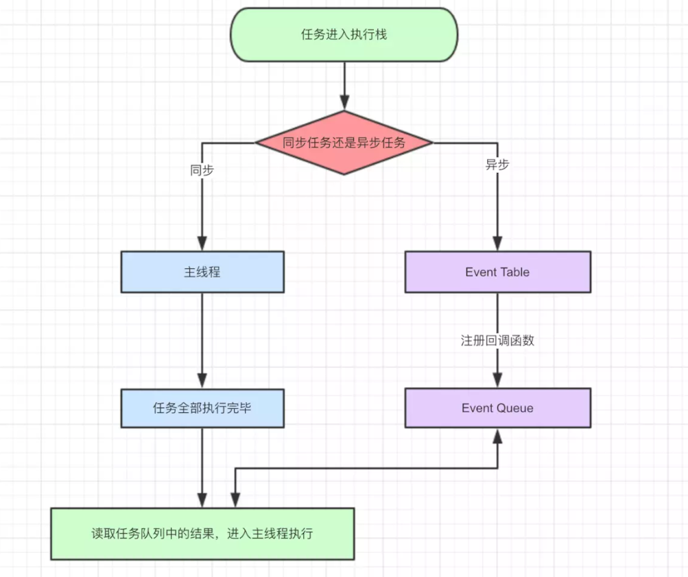
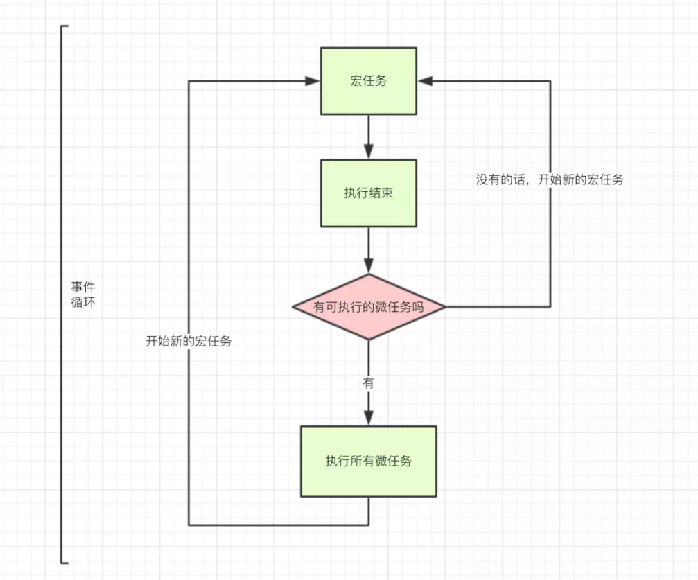

# 异步
## eventLoop
### 关于javascript
javascript是一门单线程语言，在最新的HTML5中提出了Web-Worker，但javascript是单线程这一核心仍未改变。所以一切javascript版的"多线程"都是用单线程模拟出来的，一切javascript多线程都是纸老虎！
### 事件循环的由来
既然js是单线程，那就像只有一个窗口的银行，客户需要排队一个一个办理业务，同理js任务也要一个一个顺序执行。如果一个任务耗时过长，那么后一个任务也必须等着。那么问题来了，假如我们想浏览新闻，但是新闻包含的超清图片加载很慢，难道我们的网页要一直卡着直到图片完全显示出来？
### 事件的类型
**同步任务**
同步任务指的是，在主线程上排队执行的任务，只有前一个任务执行完毕，才能执行后一个任务。
**异步任务**
不进入主线程、而进入"任务队列"（task queue）的任务，只有"任务队列"通知主线程，某个异步任务可以执行了，该任务才会进入主线程执行。
### Event Loop

- 同步和异步任务分别进入不同的执行"场所"，同步的进入主线程，异步的进入Event Table并注册函数。
- 当指定的事情完成时，Event Table会将这个函数移入Event Queue。
- 主线程内的任务执行完毕为空，会去Event Queue读取对应的函数，进入主线程执行。
- 上述过程会不断重复，也就是常说的Event Loop(事件循环)。

例子

```javascript
let data = [];
$.ajax({
    url:www.javascript.com,
    data:data,
    success:() => {
        console.log('发送成功!');
    }
})
console.log('代码执行结束');
```
上面是一段简易的ajax请求代码：
- ajax进入Event Table，注册回调函数success
- 执行console.log('代码执行结束')
- ajax事件完成，回调函数success进入Event Queue
- 主线程从Event Queue读取回调函数success并执行

### setTimeout
#### 引入问题
先看一个例子：

``` javaScript
setTimeout(() => {
    task();
},3000)
console.log('执行console');
```
根据前面我们的结论，setTimeout是异步的，应该先执行console.log这个同步任务，所以我们的结论是：

```javascript
//执行console
//task()
```
然后我们修改一下前面的代码：

```javascript
setTimeout(() => {
    task()
},3000)

sleep(10000000)
```
乍一看其实差不多嘛，但我们把这段代码在chrome执行一下，却发现控制台执行task()需要的时间远远超过3秒，说好的延时三秒，为啥现在需要这么长时间啊？
#### 本质
这时候我们需要重新理解setTimeout的定义。我们先说上述代码是怎么执行的：
- task()进入Event Table并注册,计时开始。
- 执行sleep函数，很慢，非常慢，计时仍在继续。
- 3秒到了，计时事件timeout完成，task()进入Event Queue，但是sleep也太慢了吧，还没执行完，只好等着。
- sleep终于执行完了，task()终于从Event Queue进入了主线程执行。

上述的流程走完，我们知道setTimeout这个函数，是经过指定时间后，把要执行的任务(本例中为task())加入到Event Queue中，又因为是单线程任务要一个一个执行，如果前面的任务需要的时间太久，那么只能等着，导致真正的延迟时间远远大于3秒。

我们还经常遇到setTimeout(fn,0)这样的代码，0秒后执行又是什么意思呢？是不是可以立即执行呢？
答案是不会的，setTimeout(fn,0)的含义是，指定某个任务在主线程最早可得的空闲时间执行，意思就是不用再等多少秒了，只要主线程执行栈内的同步任务全部执行完成，栈为空就马上执行。

关于setTimeout要补充的是，即便主线程为空，0毫秒实际上也是达不到的。根据HTML的标准，最低是4毫秒。

setTimeout更多使用办法 [链接](https://www.jeffjade.com/2016/01/10/2016-01-10-javacript-setTimeout/#2-setTimeout%E8%BF%90%E8%A1%8C%E6%9C%BA%E5%88%B6)

#### setInterval
上面说完了setTimeout，当然不能错过它的孪生兄弟setInterval。他俩差不多，只不过后者是循环的执行。对于执行顺序来说，setInterval会每隔指定的时间将注册的函数置入Event Queue，如果前面的任务耗时太久，那么同样需要等待。

唯一需要注意的一点是，对于setInterval(fn,ms)来说，我们已经知道不是每过ms秒会执行一次fn，而是每过ms秒，会有fn进入Event Queue。一旦setInterval的回调函数fn执行时间超过了延迟时间ms，那么就完全看不出来有时间间隔了。这句话请读者仔细品味。

#### Promise与process.nextTick(callback)

传统的定时器我们已经研究过了，接着我们探究Promise与process.nextTick(callback)的表现。
process.nextTick(callback)类似node.js版的"setTimeout"，在事件循环的下一次循环中调用 callback 回调函数。

我们进入正题，除了广义的同步任务和异步任务，我们对任务有更精细的定义：

==macro-task(宏任务)：包括整体代码script，setTimeout，setInterval==
==micro-task(微任务)：Promise，process.nextTick==

不同类型的任务会进入对应的Event Queue，比如setTimeout和setInterval会进入相同的Event Queue。

事件循环的顺序，决定js代码的执行顺序。进入整体代码(宏任务)后，开始第一次循环。接着执行所有的微任务。然后再次从宏任务开始，找到其中一个任务队列执行完毕，再执行所有的微任务。听起来有点绕，我们用文章最开始的一段代码说明：


```
setTimeout(function() {
    console.log('setTimeout');
})

new Promise(function(resolve) {
    console.log('promise');
}).then(function() {
    console.log('then');
})

console.log('console');
```
- 这段代码作为宏任务，进入主线程。
- 先遇到setTimeout，那么将其回调函数注册后分发到宏任务Event Queue。(注册过程与上同，下文不再描述)
- 好啦，整体代码script作为第一个宏任务执行结束，看看有哪些微任务？我们发现了then在微任务Event Queue里面，执行。
- ok，第一轮事件循环结束了，我们开始第二轮循环，当然要从宏任务Event Queue开始。我们发现了宏任务Event Queue中setTimeout对应的回调函数，立即执行。


### 测试

```javascript
console.log('1');

setTimeout(function() {
    console.log('2');
    process.nextTick(function() {
        console.log('3');
    })
    new Promise(function(resolve) {
        console.log('4');
        resolve();
    }).then(function() {
        console.log('5')
    })
})
process.nextTick(function() {
    console.log('6');
})
new Promise(function(resolve) {
    console.log('7');
    resolve();
}).then(function() {
    console.log('8')
})

setTimeout(function() {
    console.log('9');
    process.nextTick(function() {
        console.log('10');
    })
    new Promise(function(resolve) {
        console.log('11');
        resolve();
    }).then(function() {
        console.log('12')
    })
})
```
- 整体script作为第一个宏任务进入主线程，遇到console.log，输出1。
- 遇到setTimeout，其回调函数被分发到宏任务Event Queue中。我们暂且记为setTimeout1。
- 遇到process.nextTick()，其回调函数被分发到微任务Event Queue中。我们记为process1。
- 遇到Promise，new Promise直接执行，输出7。then被分发到微任务Event Queue中。我们记为then1
- 又遇到了setTimeout，其回调函数被分发到宏任务Event Queue中，我们记为setTimeout2。


宏任务Event Queue | 微任务Event Queue
---|---
setTimeout1| process1
setTimeout2 | then1

- 上表是第一轮事件循环宏任务结束时各Event Queue的情况，此时已经输出了1和7。
- 我们发现了process1和then1两个微任务。
- 执行process1,输出6。
- 执行then1，输出8。
好了，第一轮事件循环正式结束，这一轮的结果是输出1，7，6，8。那么第二轮时间循环从setTimeout1宏任务开始：
- 首先输出2。接下来遇到了process.nextTick()，同样将其分发到微任务Event Queue中，记为process2。new Promise立即执行输出4，then也分发到微任务Event Queue中，记为then2。


宏任务Event Queue | 微任务Event Queue
---|---
setTimeout2 | process2
 | then2
 
- 第二轮事件循环宏任务结束，我们发现有process2和then2两个微任务可以执行。
- 输出3。
- 输出5。
- 第三轮事件循环开始，此时只剩setTimeout2了，执行。
- 直接输出9。
- 将process.nextTick()分发到微任务Event Queue中。记为process3。
- 将then分发到微任务Event Queue中，记为then3。

宏任务Event Queue |微任务Event Queue
---|---
 | process3
 | then3
- 第三轮事件循环宏任务执行结束，执行两个微任务process3和then3。
- 输出10。
- 输出12。
- 第三轮事件循环结束，第三轮输出9，11，10，12。

整段代码，共进行了三次事件循环，完整的输出为1，7，6，8，2，4，3，5，9，11，10，12。
(请注意，node环境下的事件监听依赖libuv与前端环境不完全相同，输出顺序可能会有误差)


```javascript
console.log('script start')

async function async1() {
  await async2()
  console.log('async1 end')
}
async function async2() {
  console.log('async2 end')
}
async1()

setTimeout(function() {
  console.log('setTimeout')
}, 0)

new Promise(resolve => {
  console.log('Promise')
  resolve()
})
  .then(function() {
    console.log('promise1')
  })
  .then(function() {
    console.log('promise2')
  })

console.log('script end')
// script start => async2 end => Promise => script end => promise1 => promise2 => async1 end => setTimeout
```

首先先来解释下上述代码的 async 和 await 的执行顺序。当我们调用 async1 函数时，会马上输出 async2 end，并且函数返回一个 Promise，接下来在遇到 await的时候会就让出线程开始执行 async1 外的代码，所以我们完全可以把 await 看成是让出线程的标志。

然后当同步代码全部执行完毕以后，就会去执行所有的异步代码，那么又会回到 await 的位置执行返回的 Promise 的 resolve 函数，这又会把 resolve 丢到微任务队列中，接下来去执行 then 中的回调，当两个 then 中的回调全部执行完毕以后，又会回到 await 的位置处理 返回值，这时候你可以看成是 Promise.resolve(返回值).then()，然后 await 后的代码全部被包裹进了 then 的回调中，所以 console.log('async1 end') 会优先执行于 setTimeout。

如果你觉得上面这段解释还是有点绕，那么我把 async 的这两个函数改造成你一定能理解的代码

```javascript
new Promise((resolve, reject) => {
  console.log('async2 end')
  // Promise.resolve() 将代码插入微任务队列尾部
  // resolve 再次插入微任务队列尾部
  resolve(Promise.resolve())
}).then(() => {
  console.log('async1 end')
})
```

所以 Eventloop 执行顺序如下所示：

- 首先执行同步代码，这属于宏任务
- 当执行完所有同步代码后，执行栈为空，查询是否有异步代码需要执行
- 执行所有微任务
- 当执行完所有微任务后，如有必要会渲染页面
- 然后开始下一轮 Eventloop，执行宏任务中的异步代码，也就是 setTimeout 中的回调函数
- 
所以以上代码虽然 setTimeout 写在 Promise 之前，但是因为 Promise 属于微任务而 setTimeout 属于宏任务，所以会有以上的打印。

微任务包括 process.nextTick ，promise ，Object.observe ，MutationObserver。

宏任务包括 script ， setTimeout ，setInterval ，setImmediate ，I/O ，UI rendering。

这里很多人会有个误区，认为微任务快于宏任务，其实是错误的。因为宏任务中包括了 script ，浏览器会先执行一个宏任务，接下来有异步代码的话才会先执行微任务。

## eventLoop总结
### 同步任务
同步任务指的是，在主线程上排队执行的任务，只有前一个任务执行完毕，才能执行后一个任务。

### 异步任务
不进入主线程、而进入"任务队列"（task queue）的任务，只有"任务队列"通知主线程，某个异步任务可以执行了，该任务才会进入主线程执行。

### 宏任务（macrotask）
在 ES6 规范中，macrotask 称为 task

包括
- script 
- setTimeout 
- setInterval 
- setImmediate 
- I/O 

###  微任务（microtask）
在 ES6 规范中，microtask 称为 jobs

- process.nextTick 
- promise 
- Object.observe 
- MutationObserver

### setTimeout
**比设定要晚运行**

本质上setTimeout是经过制定时间后，把要执行的任务加入event queue，由于单线程是一个一个执行，如果前面的任务需要时间太久，那么只能等。

**最短间隔4ms**

HTML 5标准规定，setTimeout的最短时间间隔是4毫秒。在浏览器中，setTimeout()/setInterval() 的每调用一次定时器的最小间隔是4ms，这通常是由于函数嵌套导致（嵌套层级达到一定深度），或者是由于已经执行的setInterval的回调函数阻塞导致的

### this
由setTimeout()调用的代码运行在与所在函数完全分离的执行环境上。这会导致，这些代码中包含的 this 关键字在非严格模式会指向 window (或全局)对象，严格模式下为 undefined，这和所期望的this的值是不一样的。

### setInterval
对于setInterval(fn,ms)来说，们已经知道不是每过ms秒会执行一次fn，而是每过ms秒，会有fn进入Event Queue。

### requestAnimationFrame
大多数电脑显示器的刷新频率是60Hz，大概相当于每秒钟重绘60次。大多数浏览器都会对重绘操作加以限制，不超过显示器的重绘频率，因为即使超过那个频率用户体验也不会有提升。因此，最平滑动画的最佳循环间隔是1000ms/60，约等于16.6ms

## Promise

## Generator和async