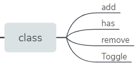
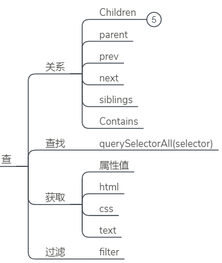
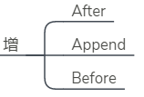
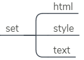

# 原生替换jQuery方案列表
## class

### add class

**JQUERY**
```javascript
$(el).addClass(className);
```

**IE 10+**
```javascript
el.classList.add(className);
```

### has class

**JQUERY**
```javascript
$(el).text();
```

**IE10+**
```javascript
el.classList.contains(className);
```

### remove class
**JQUERY**
```javascript
$(el).removeClass(className);
```

**IE10+**
```javascript
el.classList.remove(className);
```

### toggle class
**JQUERY**
```javascript
$(el).toggleClass(className);
```

**IE10+**
```javascript
el.classList.toggle(className);
```

## 元素操作-查


### 查找

**JQUERY**
```javascript
$('.my #awesome selector');
```

**IE8+**
```javascript
document.querySelectorAll('.my #awesome selector');
```

## 元素操作-关系

### children
**JQUERY**
```javascript
$(el).children();
```

**IE9+**
```javascript
el.children
```

### parent
**JQUERY**
```javascript
$(el).parent();
```

**IE8+**
```javascript
el.parentNode
```

### prev
**JQUERY**
```javascript
$(el).prev();
```

**IE9+**
```javascript
el.previousElementSibling
```

### next
**JQUERY**
```javascript
$(el).next();
```

**IE9+**
```javascript
el.nextElementSibling
```

### siblings
**JQUERY**
```javascript
$(el).siblings();
```

**IE9+**
```javascript
Array.prototype.filter.call(el.parentNode.children, function(child){
  return child !== el;
});
```

### contains
**JQUERY**
```javascript
$.contains(el, child);
```

**IE8+**
```javascript
el !== child && el.contains(child);
```
## 元素操作-获取

### 获取属性值
**JQUERY**
```javascript
$(el).attr('tabindex');
```

**IE8+**
```javascript
el.getAttribute('tabindex');
```

### 获取html
**JQUERY**
```javascript
$(el).attr('tabindex');
```
**IE8+**
```javascript
el.innerHTML
```

### 获取CSS样式
**JQUERY**
```javascript
$(el).css(ruleName);
```

**IE9+**
```javascript
getComputedStyle(el)[ruleName];
```
> getComputedStyle只读，获取样式最终结果

### 获取文本内容
**JQUERY**
```javascript
$(el).text();
```
**IE9+**
```javascript
el.textContent
```

### 过滤
**JQUERY**
```javascript
$(selector).filter(filterFn);
```
**IE8+**
```javascript
Array.prototype.filter.call(document.querySelectorAll(selector), filterFn);
```

### **增**


### after
**JQUERY**
```javascript
$(el).after(htmlString);
```

**IE8+**
```javascript
el.insertAdjacentHTML('afterend', htmlString);
```
[insertAdjacentHTML](./nojquery.md#insertadjacenthtml)

### Append
**JQUERY**
```javascript
$(parent).append(el);
```
**IE8+**
```javascript
parent.appendChild(el);
```

### before
**JQUERY**
```javascript
$(el).before(htmlString);
```

**IE8+**
```javascript
el.insertAdjacentHTML('beforebegin', htmlString);
```

## 元素操作-改


### attirbutes
**JQUERY**
```javascript
$(el).attr('tabindex', 3);
```

**IE8+**
```javscript
el.setAttribute('tabindex', 3);
```
### Html
**JQUERY**
```javascript
$(el).html(string);
```
**IE8+**
```javascript
el.innerHTML = string;
```

### style
**JQUERY**
```javascript
$(el).css('border-width', '20px');
```
**IE8+**
```javascript
el.style.borderWidth = '20px';
```

### text
**JQUERY**
```javascript
$(el).text(string);
```
**IE9+**
```
el.textContent = string;
```

## 元素操作-删
**JQUERY**
```javascript
$(el).remove();
```
**IE8+**
```javascript
el.parentNode.removeChild(el);
```

### clone
**JQUERY**
```javascript
$(el).clone();
```

**IE8+**
```javascript
el.cloneNode(child);
```

## 技巧
### each
**JQUERY**
```javascript
$(selector).each(function(i, el){ });
```

**IE9+**
```javascript
var elements = document.querySelectorAll(selector);
Array.prototype.forEach.call(elements, function(el, i){ });
```

### 深度扩展
**JQUERY**
```javascript
$.extend(true, {}, objA, objB);
```

**IE8+**
```javascript
function extend() {
     let name, options, copy, src
     let length = arguments.length
     let target = arguments[0] || {}
     for(let i=1; i<length; i++) {
        options = arguments[i]
        if(options != null) {
            for(name in options) {
                copy = options[name]
                src = target[name]
                if(copy && typeof copy == 'object') {
                    target[name] = extend(src, copy)
                } else if(copy != undefined) {
                    target[name] = copy
                }
            }
        }
     }
     return target
 }
```

### AJAX
**JQUERY**
```javascript
$.getJSON('/my/url', function(data) { });
```
**IE10+**
```javascript
var request = new XMLHttpRequest();
request.open('GET', '/my/url', true);
request.onload = function() {
  if (this.status >= 200 && this.status < 400) {
    // Success!
    var data = JSON.parse(this.response);
  } else {
    // We reached our target server, but it returned an error
  }
};

request.onerror = function() {
  // There was a connection error of some sort
};
request.send();
```


## 附录
### insertAdjacentHTML

将指定的文本解析为HTML或XML，并将结果节点插入到DOM树中的指定位置。

```javascript
element.insertAdjacentHTML(position, text);
```
position是相对于元素的位置，并且必须是以下字符串之一：

- 'beforebegin'  元素自身的前面。
- 'afterbegin' 插入元素内部的第一个子节点之前。
- 'beforeend' 插入元素内部的最后一个子节点之后。  和append一样但是append不会解析
- 'afterend' 元素自身的后面。


