# 成长地图
首先入手一张成长地图。这地图不仅仅是关于技术上面，还有如何学习，如何高效工作和对人生的一些思考。当然每个人都拥有自己独一无二的地图，我的直供参考。只有在内心拥有地图，知道自己往哪个方向走才能不迷失方向。

如从以下方面讲述
- 前端工程师的技能地图。
- 如何循序渐进得进步。
- 入术而道

**强烈推荐阅读一下 [一个程序员的成长之路-张云龙](../../essay/20190103.md)**

这文章以更加宏观的角度来讲述程序员十几年的生涯的思考和体会。

## 技能地图
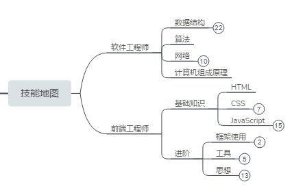

## 软件工程需要掌握的知识
### 为何需要掌握计算机基本知识
首先成为前端工程师之前，你必须是成为一位合格的软件工程师。然而现实是很多人都是从别的行业转过来，包括我自己也没有接受过系统的计算机教学，而且工作也太繁忙天天加班，根本没有太多时间去学基础学科。但是基础知识真的很重要。很多大佬都是说这些基础知识决定了你的天花板，大家都听到厌倦，那今天我换个角度来说。计算机基础知识就如同人的三观，他就像世界观一样，是你如何正确看待认识计算机和技术的基石。
    
这么说有点抽象，那我举个例子。我们大多数人都接受过教育，都知道下雨是因为水被蒸发变成云，然后云积累变重最后变成雨。但是有些老一辈可不这么认为，他们认为下雨是因为有雨神。正因为这种不能正确认识事物的观点，才会导致求雨舞蹈甚至拿人命祭天的悲剧。那么再举一个简单实际的编程的例子，
如js[深度拷贝](../js/1.type.md#浅拷贝与深拷贝),[闭包](../js/1.scope.md#闭包)这些初学者头疼的问题。要解决这些问题，就要回到计算机基础知识。要解决深度拷贝，就要先知道[基本类型](../js/1.type.md#基本类型)和[引用类型](../js/1.type.md#引用类型)的区别。要想理解他们的区别就要知道计算机是如何存储数据，这就涉及到计算机组成原理的基础。同样要想理解闭包,也必须了[作用域](../js/3.scope.md#作用域链)。什么是作用域，也是涉及到计算机基础。可见计算机基础和学习是息息相关。

==这些虽然很重要，但是前提是先生存下去，先把前端基本知识掌握后再补回来==

### 合格的软件工程师需要掌握哪些基本知识
#### 数据结构与算法
数据结构与算法听上去很高端很难学，其实emm。。。。。其实却是不好学。毕竟我考研专业课花费时间最多就是数据结构，但是他非常重要。计算机本质是处理数据，而数据结构就是一组数据的储存，算法就是操作数据的一组办法

以现实图书馆为例子，假如把书类比成计算机的数据。那么把书籍按照首字母拼音分类是一组结构，把书籍按照类型分类是一组结构。这种就是类似于计算机存储数据的结构。而算法就像你是一本本找，还是按类别来找还是用别的办法来找。不同的图书分类编排对应用的查找书本的方法和效率就不一样。这就是不同的算法服务于不同的数据数据结构。

常用的数据结构有

**如何学习数据结构和算法**

一开始的时候我是看《数据结构（C语言版）》-严蔚敏

说实在的，内心复杂。不知是我太菜还是书本身不友好，但是没办法只能死磕。后来工作后买了极客时间的《数据结构与算法之美》真的很好，感觉这钱没有白花。
~~然而我一分广告费都没有，只是真心觉得好才推荐，毕竟数据结构那本书给我太大痛苦~~

[极客时间-数据结构与算法之美](https://time.geekbang.org/column/126)

而且极客时间里面有JavaScript描述，挺好的。

或者可以看这本

《学习JavaScript数据结构与算法 第2版》

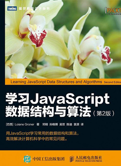

这书需要对数据结构有一定了解，因为它大多数都是代码实现，而原理简述比较少。

#### 网络工程
前端工程师不懂点网络，这个真有点说不过去。感觉有点像海边的人不会游泳一样。

**推荐几本书**

《网络是如何链接的》

《图解http》

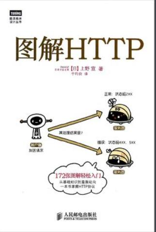

以上这两本是比较轻松简单入门，要想系统点还需要看

《计算机网络》 -谢希仁

其中对于http，tcp需要重点关注。

#### 计算机组成原理
前端对这个要求不会太高，稍微了解一下基本概念。

推荐看[中国大学MOOC-计算机组成原理-电子科技大学](https://www.icourse163.org/course/UESTC-1001543002)

## 前端工程师需要掌握的
html、css、JavaScript三剑客是最最基本。

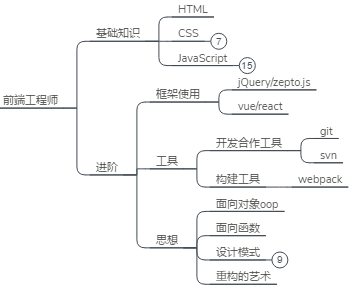
## 如何学习html
html本身就是语义化，所以学习起来不会有困难。可以上网找点视频，或者各种跟着以下网站敲一下

[慕课网-初步认识html与css](https://www.imooc.com/learn/9)

[w3cschool](https://www.w3cschool.cn/html/)

[MDN-HTML教程](https://developer.mozilla.org/zh-CN/docs/learn/HTML/Introduction_to_HTML)

如果实在看不下去就买点视频教程吧。虽然个人不是很支持盗版，但是有时真的太穷没办法。

在网易时候买的微专业，花了1k多，心痛。员工还没折打。。。。。

不过玩笑归玩笑，这课程真为我节约很多时间，差不多用金钱买时间吧，没有这个可能连第一份工作都没有。如果有能力还是支持一下正版。

## 如何学习css
可以按照上面的网站的教程来敲一下，然后推荐几本书

[《css手册》](http://css.doyoe.com/) 查缺补漏

#### 《CSS权威指南》 打基础
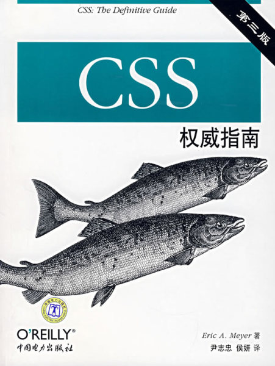

#### 《CSS揭秘》 里面有丰富的案例和技巧
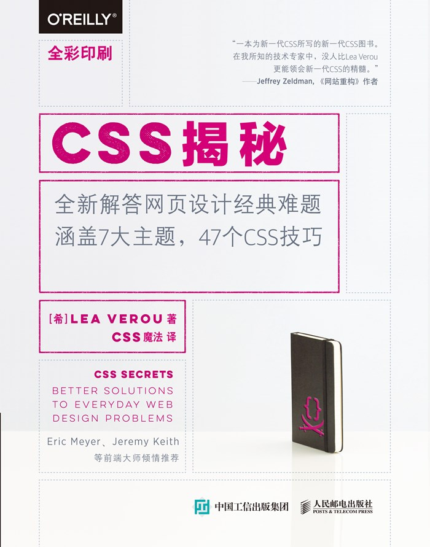

##### 《css世界》 这个需要基础扎实并有一定经验看，此书会让你大呼过瘾~~(除了有点唠叨，但是是好书)~~

## 如何学习JavaScript
之前的css和html都比较用于入门，毕竟他们都是属于标记语言，本身就具有一点的语义化，弱逻辑，但是JavaScript就不一样。JavaScript博大精深，需要用大量时间学习和专研。在推荐教程之前，我们聊聊如何渐进式学习JavaScript。
那么我们以一个武侠小说主人公为例子来简述
- 出入江湖
- 拜师入门
- 苦练绝技
- 大战沙场
- 追溯本源

### 初入江湖
这时候的你跟着教程走，可能对闭包原型链这些一点都不会。但是都是没有问题。就像打游戏一样，不可能新手教程都没过就直接打BOSS，这不现实。这时候的你敲点demo，了解一下JavaScript是干啥用，在大脑里面有点印象就好。

对于《高级程序设计(第三版)》看不懂先记下来。之后回头随着你敲代码的数量增多，会有一定的理解。

**推荐教程**

##### 《JavaScript高级程序(第三版)》
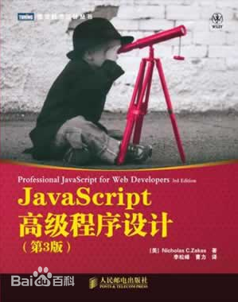

[慕课网-JavaScript入门篇](https://www.imooc.com/learn/36)

[慕课网-JavaScript进阶篇](https://www.imooc.com/learn/10)

[w3cshool-JavaScript](https://www.w3cschool.cn/javascript/)

[MDN-JavScript](https://developer.mozilla.org/zh-CN/docs/Web/JavaScript)

### 拜师入门
我也想有个师傅带带我o(╥﹏╥)o。可惜并没有，这时候的你对JavaScript有了更高的要求，也可以做点简单的demo。但是这还不够的。你需要翻越名为作用域、原型链和异步这三座大山，而这三座大山即使你把《高程3》反反复复看也难以一时顿悟。那么以下几位师傅能帮到你。

#### 《你不知道的JavaScript(上)》
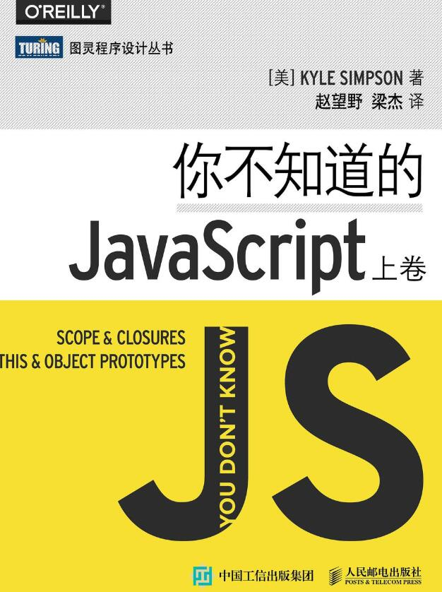

这书对于作用域，闭包讲解非常棒。

#### 《JavaScript 忍者秘籍》

这书可能对于现在的你还有点早，需要一定功力才能看懂，但是没关系。看完一段时间再回来看会有所获的。

#### 推荐视频教程
[慕课网-前端JavaScript面试技巧](https://coding.imooc.com/learn/list/115.html)
这个真的很好，我看书的时候一脸懵逼，但是看完这个后就突然开窍，再去看书豁然开朗。
~~我只有3个月试用期，学不会就失业，所有工资基本都是买书买视频教程，不仅贫穷还欠了挺多钱。这里推荐的付费教程是我在这么多中，我觉得对我很有帮助的。并没有收一分钱广告费~~

### 苦练武功
这时候的你已经有一定的基础。但是单靠有基础是无法应对工作的，这时候的你需要一些工具与框架。

#### vue?react?
这个看个人或者公司。对于新人个人推荐vue，因为他渐进式容易上手，而且框架思想上是相通的。把vue学了，如果出来工作需要用react很快上手。

怎么学vue，虽然说别人说看官方文档是最佳的学习路径，但是别人是老司机，我看官方文档时候是一脸懵逼的。因为缺乏很多基本概念和实践，无法领会作者的意图。

我个人建议是看点视频敲点demo，然后看官方文档会顺很多。

**推荐**
#### [技术胖](http://jspang.com/post/vue2-1.html)
技术胖业界良心，看教程不花一分钱。

##### [慕课网-vue-去哪儿](https://coding.imooc.com/class/203.html)
这个是学习vue的比较基础东西，敲完就看官方文档没有障碍。

### [慕课网-vue-饿了么](https://coding.imooc.com/class/chapter/74.html)
之前有个vue1.0的，没想到居然重置了。这个我还没看，不过黄轶老师讲课不会差到哪里。

### [慕课网-vue-京东](https://coding.imooc.com/class/175.html)
这门课程最大特点是让你有模块化和工程思想。

### webpack
### [官网-中文文档](https://www.webpackjs.com/concepts/)
其实官网挺完善，学习webpack先了解一下基本概念。

### [技术胖 webpack3.0](http://jspang.com/post/webpack3x.html)
注意版本，目前是4.x了，但是学习3.x主要是学习概念和动手写一下，一定要自己动手写一下。

### 深入浅出webpack
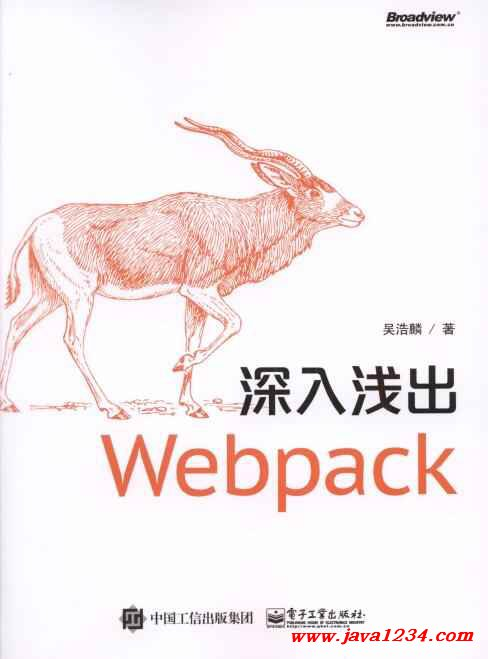

这书最好有把上面推荐的给看了和敲了。这书比较系统，能完善知识盲点。

### jQuery?
虽然现在jQuery越来越少人用，但是不少公司老项目还是要维护。本人也把公司旧项目的jQuery替换成vue。看需要学吧，看[菜鸟教程](http://www.runoob.com/jquery/jquery-tutorial.html)，[中文文档](http://jquery.cuishifeng.cn/)也够用了。

==虽然jQuery已经慢慢退出历史舞台，但是他的设计理念永远不会过时。他的源码包含丰富的设计模式和很多实用的工具函数，jQuery源码比较多可以看zepto的源码。本人目前也经常看zepto的源码，把里面的工具函数抽离出来变成模块并应用在工程中==

### ES6开启
所谓的ES6只不过是新的规范，由于目前不同版本浏览器兼容问题，需要使用babel来编译。为何还要这么麻烦还要使用es6。因为使用ES6的语法会更加高效，如果用砍树来比喻，ES5是用斧头砍，ES6是用电锯砍。开发效率真的高了很多，把以前的项目重构成ES6语法，加班变少很多。

这个阶段要学的东西真的好多好多啊o(╥﹏╥)o 学不动了。

**推荐教程**
[阮一峰 ES6入门](http://es6.ruanyifeng.com/)
一本就够了，不用其他了。

### 大战沙场
你已经拥有足够的基础和能力去面对工作上面的业务逻辑。已经能做出一些项目，经历过如此痛苦的苦练功夫阶段，这阶段你要做的是什么

答案只有一个了————不断实践和反复修炼武功。

把之前的书反反复复看，完善自己的知识库。因为你做得多，对基础有又更深入的了解，因为你对基础有深入了解，你会越来越熟练。这就像滚雪球效应，只会越滚越大越快。

**推荐以下查缺补漏**

#### [面谱](https://yuchengkai.cn/docs/frontend/)

#### [javascript工程师必须知道的33个概念](https://github.com/stephentian/33-js-concepts)

#### [冴羽的博客](https://github.com/mqyqingfeng/Blog)

#### [汤姆大叔的博客](https://www.cnblogs.com/TomXu/archive/2011/12/15/2288411.html)

### 追溯本源
这时候的你对于业务代码的实现已经不是问题。很多人也满足于此，但是这还是不够的。这时候你还只是个“码农”，并没有成为真正的程序员，没有创造出属于自己的东西。然而创造永远不是简单的活。这时候这句话可以帮到你

> 好的艺术家模仿皮毛，伟大的艺术家窃取灵魂

这时候你需要关注一些设计模式和设计原则，开始去看源码。模仿别人的轮子，开始自己造轮子，模仿并不可耻。全部人都是通过模仿，然后积累成为自己的东西。

#### 《JavaScript设计模式》-张容铭
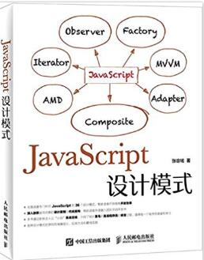

#### 《JavaScript设计模式与开发实践》-曾探 
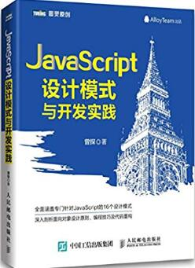

这两本都可以，随便挑一本。
~~小孩子才做选择，我全都要~~

然后就可以开始源码之旅。怎么看源码，当然不是一上来就从第一行看，而是先找找别人的看完写的经验。当然有人说有一手资料为何还好看二手甚至三手资料，这观点又对的地方也有不对。对的是一手资料信息量更为广大和正确，错的是或者说不适合的是，每个人水平不一。对于刚刚看源码的人来说，直接看源码会像看天书一样，不知在看啥，又浪费时间又难受。这时候需要前人把你梳理一下知识。就像刚刚出生的鸟儿不能直接吃虫子，需要母鸟咀碎后才能吃。当你看源码看多后，形成自己方法论后再直接看源码也不迟。

一开始就又简单又实用的`underscore.js`入手。代码量不多，而且有很多实用的工具函数。不需要一口气看完，每天按模块看一点。

#### 源码入门
[undersercore-源码分析-吴晓军](https://legacy.gitbook.com/book/yoyoyohamapi/undersercore-analysis/details)这个就够，先把本看一下，然后再去他的GitHub看中文备注的源码，自己再敲一下。

看完undersercore可以试试看[Lodash](https://www.lodashjs.com/)，这两个都是一脉相承。

如果有空的话还可以看看zepto，代码量不多。推荐看[Zepto源码分析-Hefty](https://yeyuqiudeng.gitbooks.io/reading-zepto/content/)

#### vue
对于vue这么庞大的源码量更加需要前人的指点。我看源码的顺序是这样的。

1. [剖析 Vue.js 内部运行机制](https://juejin.im/book/5a36661851882538e2259c0f)这么便宜买不来吃亏。把原理抽象为小 Demo，真的对新手十分友好。看完这个后再去作者的GitHub里面看补充的[染陌同学](https://github.com/answershuto/learnVue)

2. [逐行级别的源码分析](https://github.com/HcySunYang/vue-design)这个我还在看，收益很多。

3. [Vue.js 源码全方位深入解析](https://coding.imooc.com/class/228.html) 这个快500元。我一开始就是看这个，看得我一脸懵逼。这是因为那时候我功力还不够，基础没打好也没有太多看源码的经验，所有不是黄轶老师讲得不好不够深入浅出。现在看回去真的发现讲得挺全面的。

其实当你看完[剖析 Vue.js 内部运行机制](https://juejin.im/book/5a36661851882538e2259c0f)就可以开始模仿别人写的UI框架。

我推荐是先看[Mint UI](https://mint-ui.github.io/#!/zh-cn)里面的源码写得不算难，但是由于在vue1.0就有，里面有很多东西都没有充分利用到vue2.5的特性。导致可能看上去写法没那么高明，但是有个好处就是易读。

[Vue.js 组件精讲](https://juejin.im/book/5bc844166fb9a05cd676ebca)这本书只有你经历过写组件，每天看别人源码，自己模仿，每天百思不得其解的痛苦后看，你才能深深感受到他的价值。我看的时候内心只有，还有这种操作，令人窒息的操作。毕竟我之前也是经常看iview的源码，那时候好多都没有了解到作者的意图。~~主要是自己太菜~~

看完组件精简小册子可以挑一个自己喜欢的UI框架慢慢看，慢慢模仿。

- [iview](https://www.iviewui.com/)
- [vant](https://youzan.github.io/vant/#/zh-CN/intro)
- [vux](https://vux.li/)

我自己大概拿这些参考

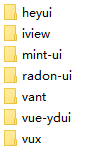

造轮子造到质疑人生。

### 最后
o(╥﹏╥)o本渣渣只是刚刚走到追溯本源。为何没怎介绍node，因为我也只是学了点皮毛，敲了一下node.js的基本api造了半个后端而已。不敢讲，怕被大神锤。

