# 教你科学上网
## 购买国外服务器
Vultr是美国的一个VPS服务商，全球有15个数据中心，可以一键部署服务器。采用小时计费策略，可以在任何时间新建或者摧毁VPS。价格低廉，最便宜的只要2.5一个月，支持支付宝

[Vultr 官网](https://www.vultr.com/)

## 创建账号

填写邮箱、密码（至少10个字符，并且有一个大写字母、一个小写字母、一个数字），最后点击后面的“Create Account”即可。
注册完会收到一封验证邮件。

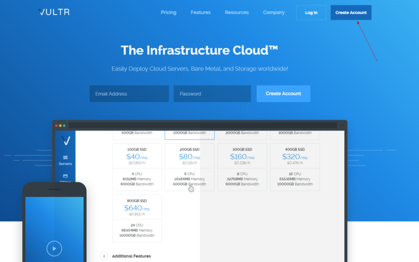

设置密码一定要复杂，按照下图进行设置

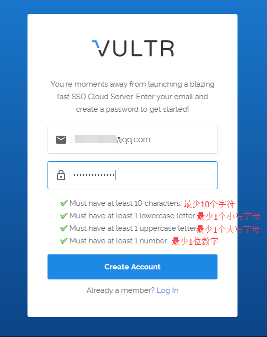

## 充值
验证并登录后，我们会跳转到充值界面，或者从“Billing->Make Patment”进入：

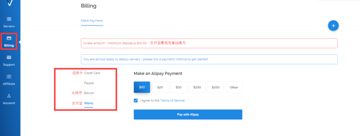

最低充值10刀起步，推荐使用支付宝，人手一个非常方便。大约60多块RMB。

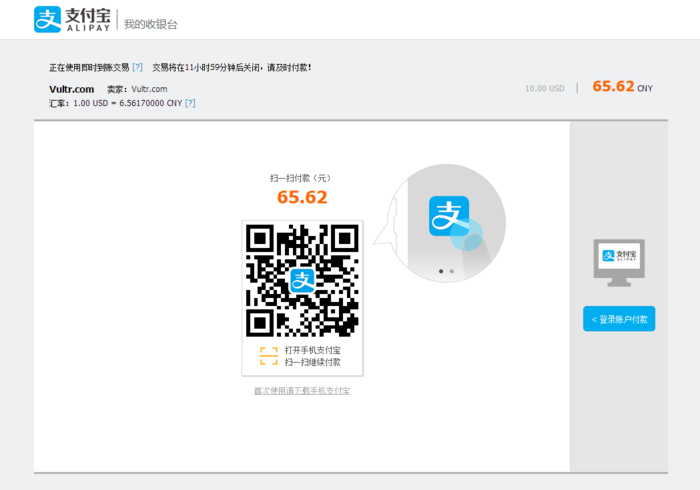

付款完毕后，就可以在Vultr账户里看到你的余额了。

## 创建服务器
选择右上角的蓝色+号按钮，进入Deploy页面，选择服务器配置：
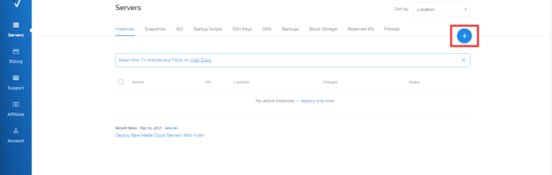

## 选择机房位置
推荐服务器使用Los Angeles和Tokyo的，如图：

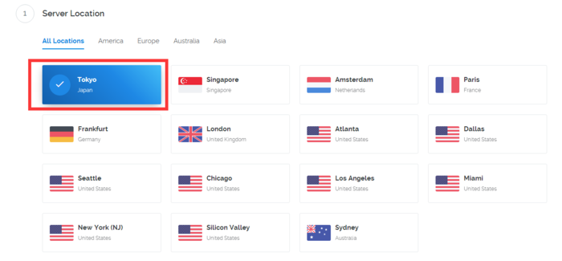

选择操作系统和配置
操作系统按照我这里选择就行，配置我选择的是5美元一个月的，个人使用足够了。


其它选项不必选择，最后点击下面的“Deploy Now”进行确认，如图：

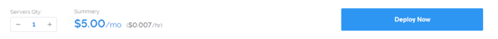

## 创建成功
到目前我们的VPS已经创建完成
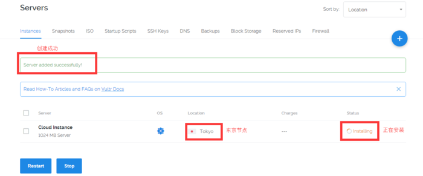

## VPS信息
选择Deploy后，过个几分钟，就安装成功了。
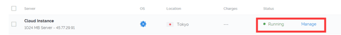

点击“Manage”就可以看到VPS的详细信息：
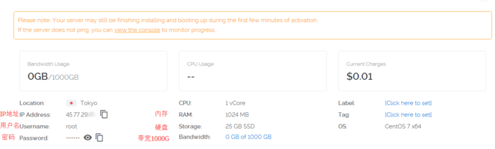

## 远程连接VPS

推荐大家使用XShell软件进行连接，XShell的下载地址请自行百度解决，下面是XShell的使用教程。

1、安装XShell

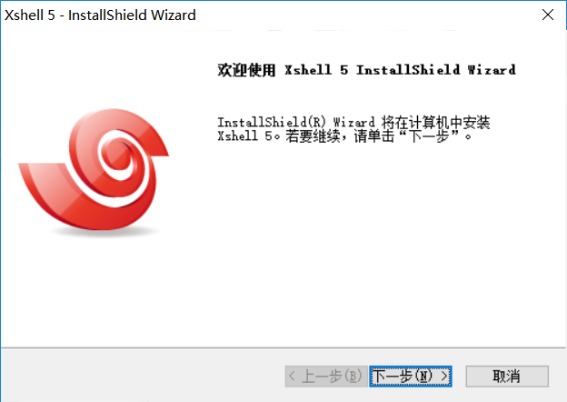

2、选择“免费为家庭/学校”

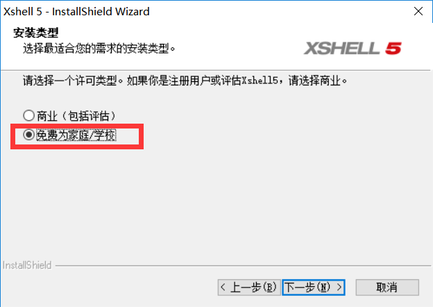

3、选择中文语言

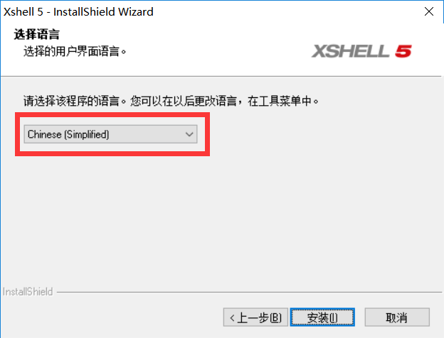

然后开始安装。

4、安装完成后，打开Xshell

选择文件->新建
协议选择“ssh”
主机是你的VPS的IP地址
端口：22
填写完成后，点击“确定”

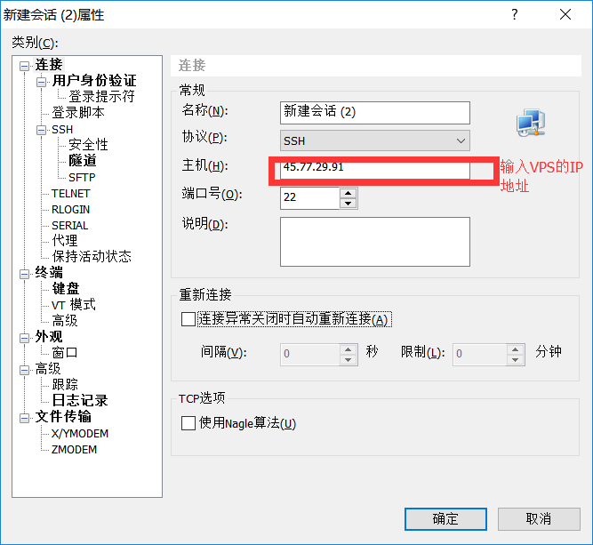

5、输入用户名，默认用户名为“root”

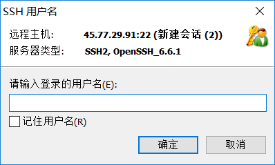

6、输入密码：
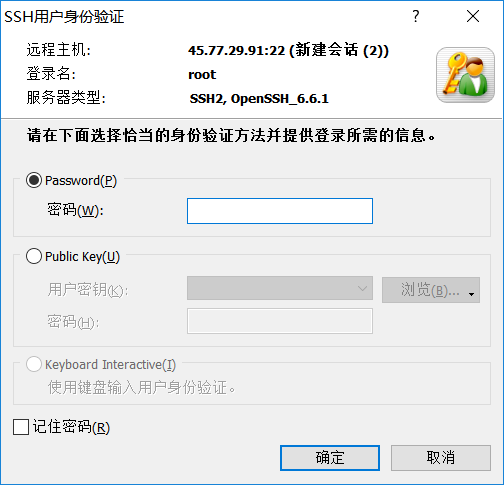

7、连接成功：
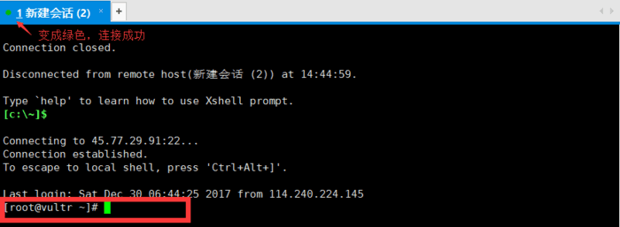

## Vultr快速搭建ShadowSocks
运行以下命令（全选后复制粘贴）
```
wget --no-check-certificate -O shadowsocks.sh https://raw.githubusercontent.com/teddysun/shadowsocks_install/master/shadowsocks.sh

chmod +x shadowsocks.sh
./shadowsocks.sh 2>&1 | tee shadowsocks.log
```
按下面提醒输入密码、端口、加密方式

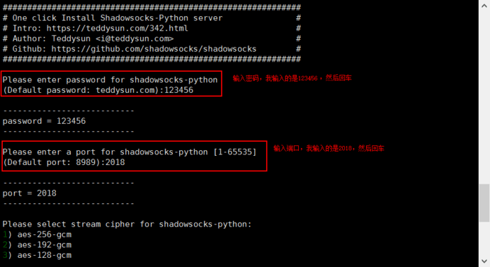

加密方式直接输入序列号
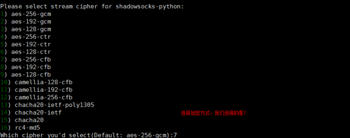

等待数分钟后SS以及配置成功
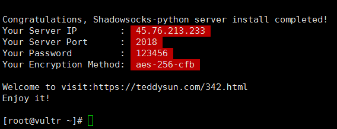

## ShadowSocks下载和使用
Windows客户端
下载地址：
链接: 

https://pan.baidu.com/s/1CX4RpKJNnxDouqcIogN2wA 

提取码: 6vb5

下载解压后打开，如图：

填写刚才的配置好的SS信息，点击确定
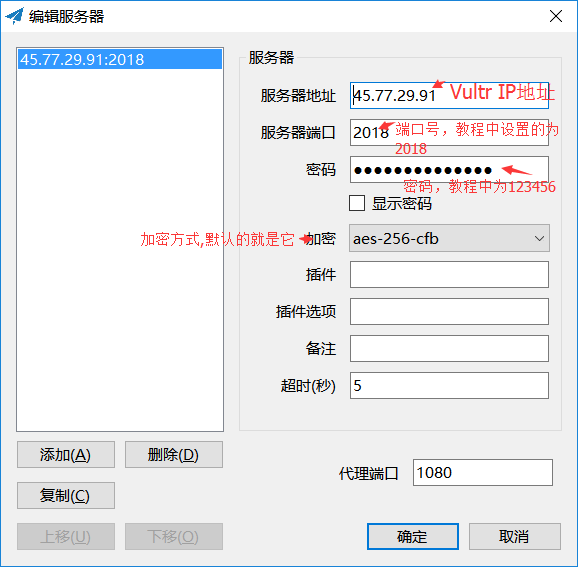


